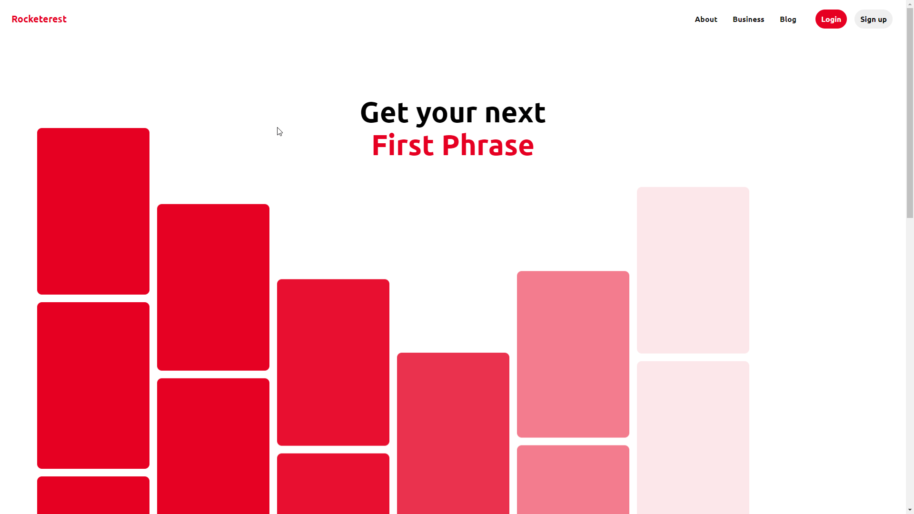

<div align="center">
    
    
    &nbsp;
    
</div>

<br>



<br>

<div align="center">
:link: https://marcelosperalta.github.io/ui_clone_pinterest/
</div>

# UI Clone - Pinterest

[freeCodeCamp - Take Home Projects - Build a Pinterest Clone](https://www.freecodecamp.org/learn/coding-interview-prep/take-home-projects/build-a-pinterest-clone)  

[Rocketseat - Recriando home do Pinterest com HTML, Sass e JavaScript | UI Clone #16](https://www.youtube.com/watch?v=XdqD8qi44Cg)  

## Tools

[SASS](https://sass-lang.com/)  

## Visual Studio Code extensions

[Live Server](https://marketplace.visualstudio.com/items?itemName=ritwickdey.LiveServer)  

[Live Sass Compiler](https://marketplace.visualstudio.com/items?itemName=ritwickdey.live-sass)*  

*To work properly in this project, after change any ```_x.scss``` file (e.g. ```_variables.scss```) save the ```styles.scss``` file to have the changes added to the ```styles.css``` file.  